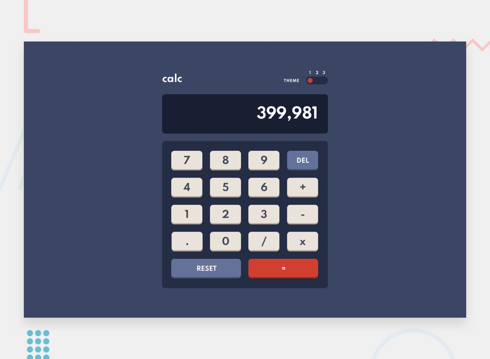

# Calc App



This is a solution to the [Calculator app challenge on Frontend Mentor](https://www.frontendmentor.io/challenges/calculator-app-9lteq5N29). Frontend Mentor challenges help you improve your coding skills by building realistic projects.

- [Solution URL](https://www.frontendmentor.io/solutions/calc-app-Vp4t2S-Yt)
- [Live Site URL](https://calc-app-omarlawaty.vercel.app/)

## Table of contents

- [Getting started](#getting-started)
- [My process](#my-process)
  - [Built with](#built-with)
  - [Useful resources](#useful-resources)
- [Author](#author)

## Getting started

Make sure to have `node.js` and `yarn`installed and that you are in the root directory of the project, then simply run:

```bash
yarn
```

To run the development server, execute:

```bash
yarn start
```

## My process

### Built with

- ReactJS
- CSS custom properties
- Flexbox
- CSS Grid

### Useful resources

- [W3schools](w3schools.com/)
- [stackoverflow](stackoverflow.com/)
- [MDN Web Docs](https://developer.mozilla.org/en-US/)

## Author

- Name - Omar Mohamed
- Frontend Mentor - [@OmarLawaty](https://www.frontendmentor.io/profile/OmarLawaty)
- Twitter - [@OmarLawaty](https://twitter.com/OmarLawaty)
